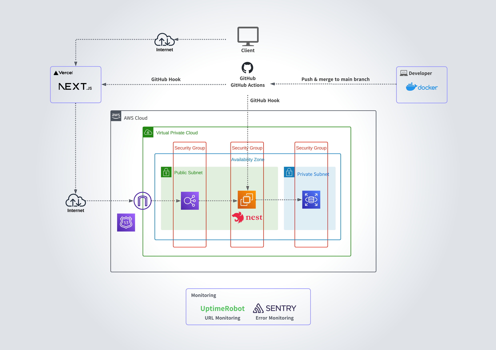
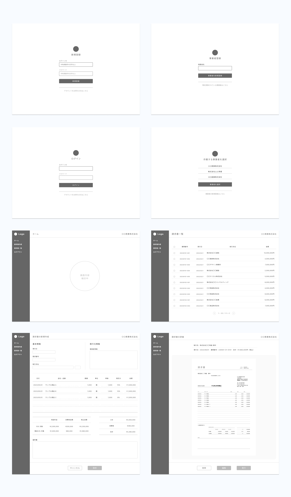
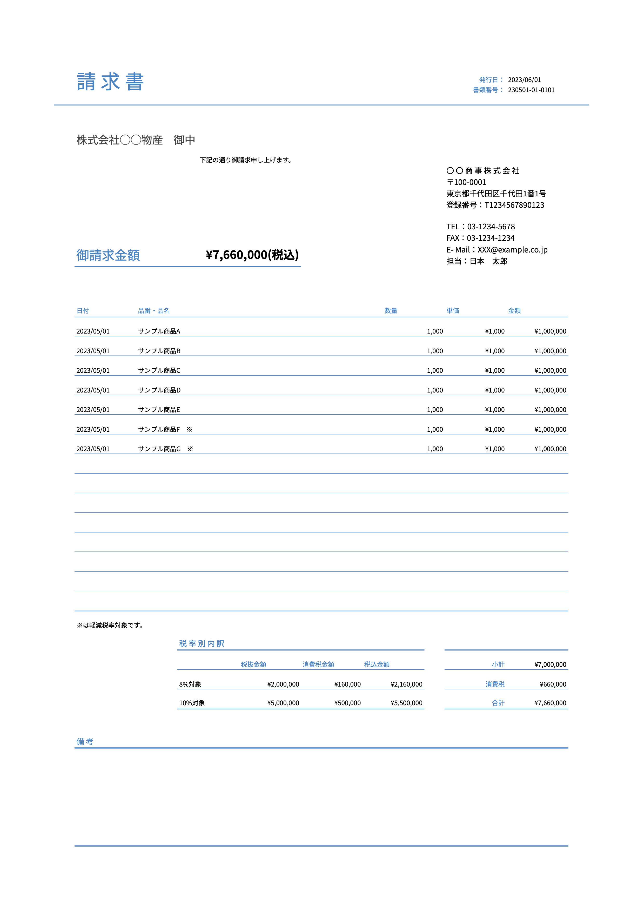
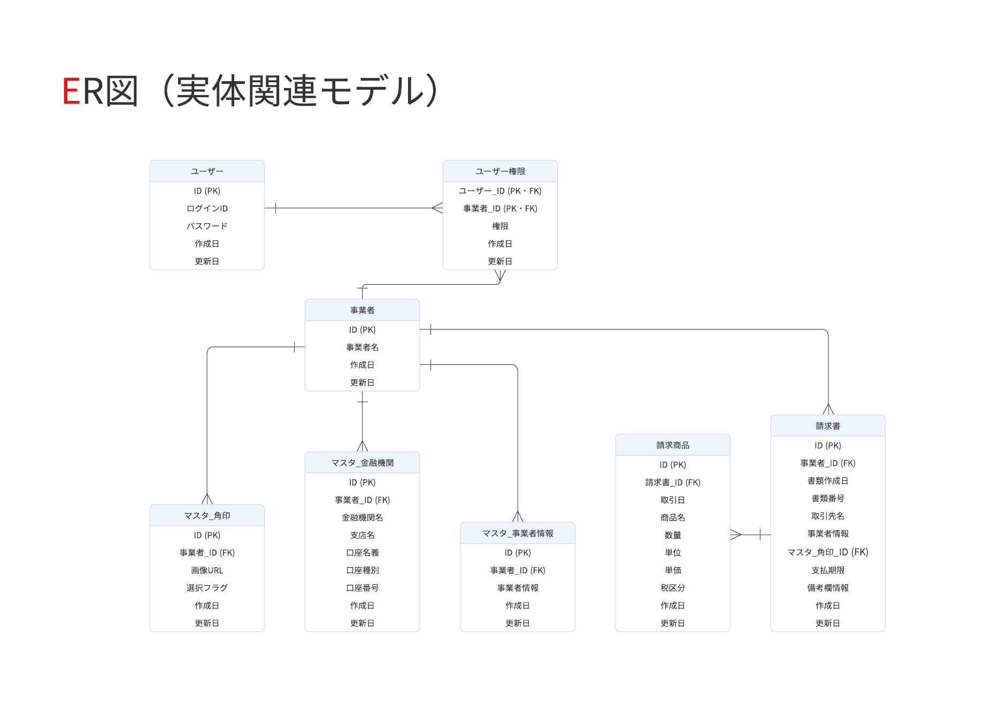
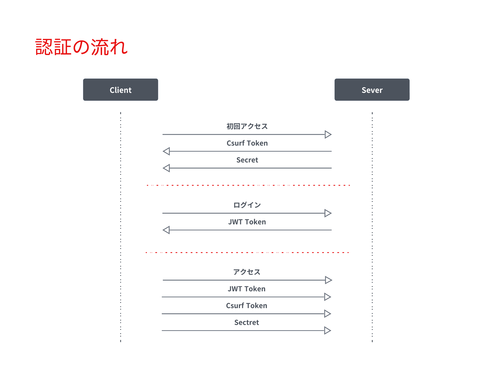
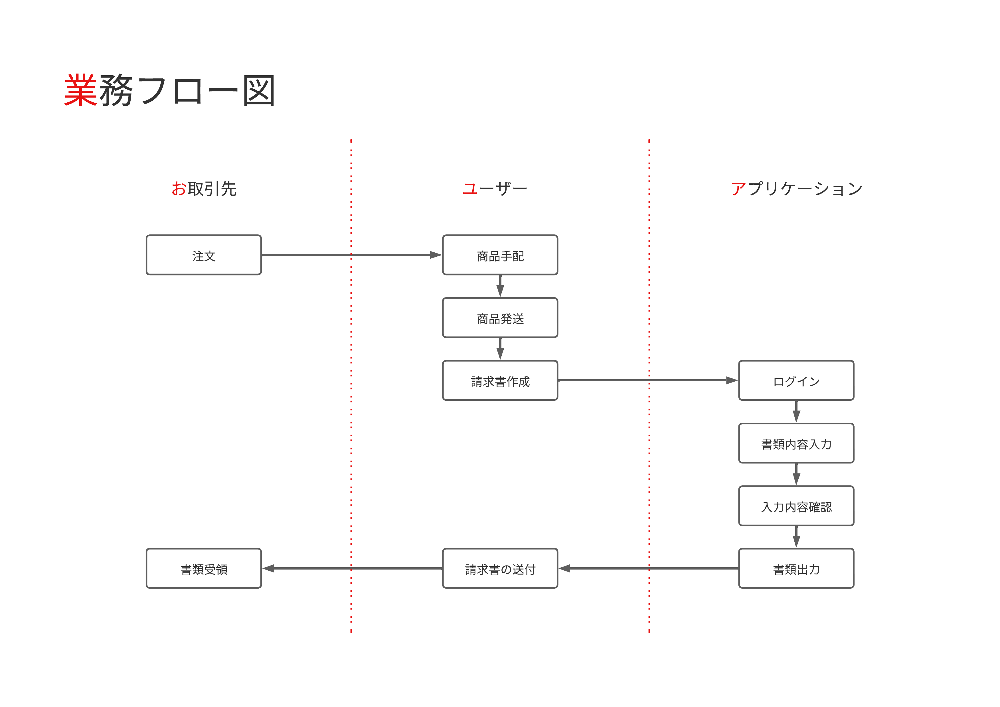
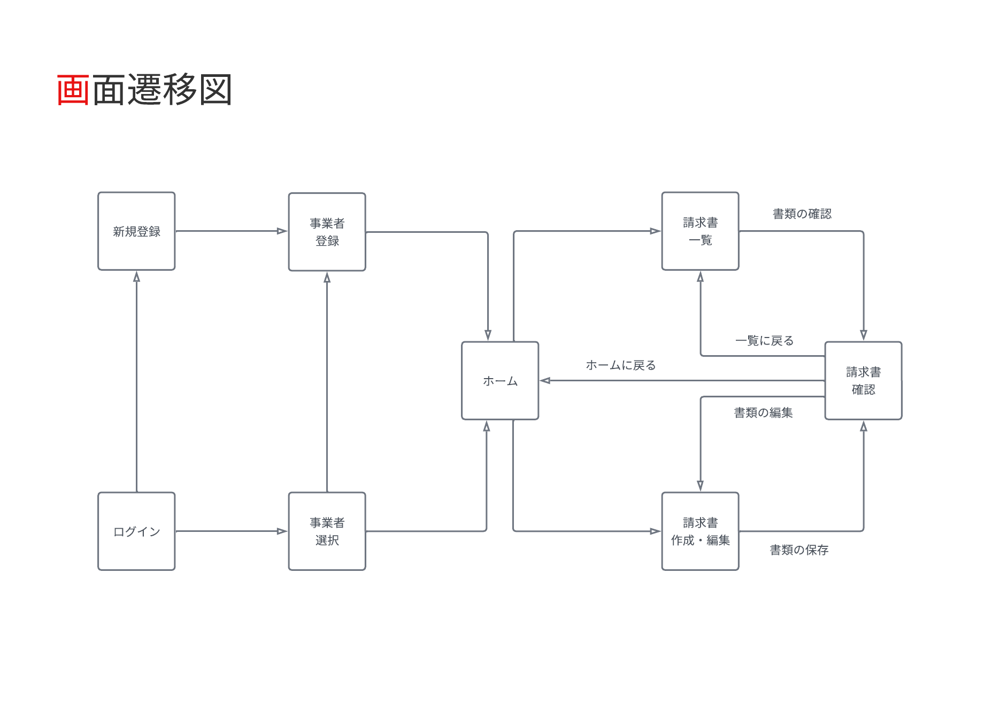

## プロダクトの概要
本プロダクトは、 クライアント企業※1 の 取引書類※2 の作成業務や、 経理・会計業務※3 の生産性を向上させることを目的としています。  
現在は フェーズ1※4 として、新しい税制に対応した請求書を、Web上で作成・発行できるアプリケーションの開発に取り組んでいます。  
段階的な機能追加を重ね、取引書類の作成業務から経理・会計業務までを一元管理できる、統合的なソリューションを実現することを目指しています。  

※1 クライアント企業とは依頼元の企業のことを指します。詳細はWHO（誰のため）をご覧ください。  
※2 取引書類とは見積書・発注書・請求書・納品書のことを指します。  
※3 経理・会計業務とは売上管理・利益管理・入金管理・支払管理・記帳・仕訳などに関する業務のことを指します。  
※4 フェーズ1とは、本プロダクトの開発における第1段階のことを指します。詳細はHOW（どのように課題を解決するのか）をご覧ください。

### WHO（誰のため）
- クライアント企業（依頼元企業）
  - 従業員数：数名
  - 事業所：東京都
  - 業種：卸売業
  - 事業内容：事務用品・日用品・防災用品などの卸売
  - 取引先：民間企業、官公庁、教育機関など
- クライアント企業の経営者（20代後半）
- クライアント企業の経理事務担当者（20代後半）

### WHAT（どのような課題を解決するのか）
- インボイス制度への対応に伴うクライアント企業の負担。
- 取引書類の作成業務における非効率な作業。
- 経理・会計業務の複雑さ。
- 求めている作業環境の快適さとのギャップ。

### WHY（なぜ開発するのか）
- より効率的に、より快適に作業ができる環境を提供し、ユーザー企業の事業発展に貢献したいという想いを実現するため。

### HOW（どのように課題を解決するのか）
- 取引書類の作成業務から経理・会計業務までを一元管理できる、統合的なソリューションを実現する。
  - フェーズ1：新しい税制に対応した請求書を、Web上で作成・発行できるアプリケーションを開発する。
  - フェーズ2：全ての 取引書類※1 を、Web上で作成・発行できる機能を追加する。
  - フェーズ3：案件ごとの 取引データ※2 を管理できる機能を追加する。
  - フェーズ4：取引データを、会計ソフトに効率的に取り込むことができる機能※3 を追加する。

※1 取引書類とは見積書・発注書・請求書・納品書のことを指します。  
※2 取引データとは、仕入先・販売先・摘要・仕入日・支払日・売上日・入金日・金額・消費税・利益・利益率などに関する情報を指します。  
※3 会計ソフトに効率的に取り込むことができる機能については、取引データをCSV形式で出力する、または会計ソフトとのAPI連携を検討しています。

### システム構成図

### 技術スタック
| Category          | Technology Stack                       |
| ----------------- | ------------------------------------   |
| Frontend          | TypeScript, Next.js                    |
| Backend           | TypeScript, NestJS, Prisma             |
| Infrastructure    | Amazon Web Services, Vercel            |
| Database          | PostgreSQL                             |
| Monitoring        | Sentry, UptimeRobot                    |
| Environment setup | Docker                                 |
| CI/CD             | GitHub Actions                         |
| Design            | Figma, Lucid                           |
| etc.              | ESLint, Prettier, Jest, Git, GitHub    |

**本プロダクトの開発に関する情報は、下記より展開してご覧ください。**

<h2>📄企画・構想・要求分析</h2>
　　

<h3>プロダクトを通じて実現したいこと</3>
　　

#### ユーザー企業が実現したいこと
- ノンコア業務の手間を減らし、コア業務に集中できる環境をつくる。
- ココロオドル環境をつくる。
- 生産性を上げる。

---

#### 僕が実現したいこと
##### 社会的
- 事業の発展に貢献する。
- 業務フローを整理して、ユーザー企業の手間を減らす。
- ココロオドル環境をつくり、働くひとを笑顔にする。

##### 個人的
- 就職を成功させる。
- 自分の人柄や技術力を正しく伝える。
- 技術力を向上させる。

---

<h3>業務分析</3>
　　

#### 基本情報
- 業種：卸売業
- 商材：事務用品・日用品・防災用品など
- 取引手段：電話・メール
- 規模：従業員数名（パートナーを含む）

#### 対象とする業務分野  
本プロダクトでの対象とする業務分野は、コア事業での取引に際して生じる業務を対象とする。

#### 取引を行う際の業務プロセス
1. 見積
   1. 顧客から見積依頼のメールが届く。
   2. 仕入先へ見積依頼のメールを送る。
2. 提案
   1. 仕入先からメールで見積書が届く。
   2. 見積書をメールで顧客へ送る。
1. 受注
   1. 顧客からメールで発注書が届く。
   2. 発注書をメールで仕入先へ送る。
2. 支払
   1. 仕入先からメールで請求書が届く。
   2. 請求書に基づいて支払い。
3. 出荷・納品
   1. 顧客へ出荷連絡のメールを送る。
   2. 配送伝票をもとに納品確認する。
   3. 請求書をメールで顧客へ送る。
4. 入金
   1. 期限が過ぎたら入金を確認する。

#### 取引を行う際の業務に付随する書類作成業務
- 提案
  -  見積書を作成する。
- 受注
  -  発注書を作成する。
  -  売上管理ファイルに案件内容を記入する。
- 納品
  -  仕入先の出荷日を売上管理ファイルに記入する。
  -  顧客への出荷日を売上管理ファイルに記入する。
  -  請求書を作成する。
  -  納品書を作成する。

#### 取引を行う際の業務に付随するファイル管理業務
- 提案
  - 案件番号の採番。
  - 仕入先の見積書を案件フォルダに保存する。
  - エクセルで作成した見積書を案件フォルダに保存する。
- 受注
  - 顧客の発注書を案件フォルダに保存する。
  - エクセルで作成した発注書を案件フォルダに保存する。
- 支払い
  - 仕入先から届いた請求書を案件フォルダに保存する。
- 納品
  - エクセルで作成した請求書を案件フォルダに保存する。
- 完了
  - 案件フォルダのファイルを、不定期でまとめて管理フォルダに移動する。

#### 取引を行う際の業務に付随する連絡業務
- 見積
  - 仕入先に見積依頼のメールを送る。
- 提案
  - 顧客に見積書をメールで送る。
- 受注
  - 仕入先に発注書を添付して発注メールを送る。（フォーマット有り：注文内容を文中に含む）
- 納品
  - 出荷連絡（フォーマット有り）する。
  - 顧客に請求書をメール送る。

#### 業務理解を深めるためのユーザーへの質問
- 取引に付随する業務はあるか？
  - 請求書と納品書を郵送で送る場合がある。その場合は送り状を作成する。
  - 提案時に資料を作成することがある。
  - 取引内容を不定期でまとめて記帳をしている。
  - 期限までに顧客からの入金がされているかを、売上管理ファイルに基づいて確認をしている。
  - 売上管理ファイルで年間の売上、利益、利益率などを確認している。
- エクセルでの書類作成に対して課題や不満はあるか？
  - インボイス制度に対応した書類作成を行いたい。
  - 案件番号を自動で採番できるようにしたい。
  - 企業名・取引条件・納期・納入場所・商品を入力する際に予測変換が出たら良い。
  - 書類の作成日を入力する手間を減らしたい。
  - よりスマートに、よりカッコよく作業をしたい。
  - 税率の変更、税込・税抜の計算方式の変更をスムーズにしたい。
  - 購入用書類に納品先を記入できるようにしたい。
  - 販売用書類と購入用書類の情報を共有し、同じデータを再度入力せずに済むようにしたい。
  - スマホで書類を作成できるようにし、スマホで取引先に送付ができるようにしたい。
- メールの送受信の課題や不満はあるか？
  - 仕入先への発注時に発注書の内容をフォーマットに沿ってメールに記載しているのだけなので自動化したい。
- 案件番号の規則は？
  - yymmdd-xx-xxxx
  - xx：日毎に01から順に採番する。
  - xxxx（上2桁）：01から順に採番。同じ案件に対して複数回見積書を作成した場合に使用。
  - xxxx（下2桁）：01から順に採番。同じ案件に対して複数回請求書を作成した場合に使用。
- 仕入先への注文メールの文はどのような構成なのか？
  - 製品、Jan(型番)、数量、納品予定日、時間指定、納品先情報、出荷主情報、備考、その他の文章。
- ファイル名の命名規則は？
  - [書類種別] + 案件番号
  - 書類種別：S=販売用、B=購入用、Q=見積書、O=発注書、I=請求書、D=納品書
  - 例：SO230401=顧客からの発注書、BO230401=仕入先への発注書
- 案件フォルダとは何か？
  - 案件ごとにファイル（見積書・発注書・請求書など）を一時的にローカルで管理するフォルダ。
- 管理フォルダとは何か？
  - 全取引の証憑書類を種類毎（見積書・発注書・請求書など）に管理するクラウド上のフォルダ。
- 売上管理ファイルとは何か？
  - 案件番号、顧客、仕入先、商品名、購入情報（出荷日、支払日、数量、購入金額）、売上記録（出荷日、入金日、数量、購入金額）、利益、利益率、回収率（顧客からの入金日-仕入先への支払日）、備考から構成される、案件ごとの取引記録。
  - 案件の進捗管理、入金管理、記帳、売上確認（利益や利益率も含む）の際に使用される。

---

<h3>ターゲット・課題・ニーズ</3>
　

#### ターゲット
- 決済者：ユーザー企業の経営者（20代後半）
- 利用者：ユーザー企業の経理事務担当者（20代後半）

---

#### ターゲットが抱える課題
- 手間
  - 書類作成。
  - 書類作成時の入力。
  - 書類管理。（書類作成時とメール受信時にタスクが発生している）
  - 発注先へのメール文作成。
  - 入金管理。（売上管理ファイルを確認している）
  - 記帳。
- 生産性 
  - 購入用書類、販売用書類、書類管理、売上記録の連携がとれていない。
  - 税率や税金の計算方式の変更に柔軟性がない。
- 機能
  - 取引書類がインボイス制度に対応していない。
  - 手元にPCがないと書類作成ができない。
- モチベーション
  - 現行システムに地味さを感じている。

---

#### ターゲットのニーズ
- 「洗練」された「便利」で「かっこいい」アプリケーションで作業したい。
- ノンコア業務の手間を徹底的に減らしてコア業務に集中したい。
- タスクの増加によるストレスや混乱を低減したい。
- システムを一つにまとめて、横断して作業することによるストレスを減らしたい。
- レスポンスの早さを大切にしており、外出先などPCがない環境での書類作成・送信をしたい。
- 無駄を減らして効率的な仕事をしたい。

---

<h3>競合調査</3>
　

#### 競合分析の目的
- 競合から必要な機能とは何かを学ぶ。
- 実現したい独自の機能をみつける。

#### 競合を特定
- 会計ソフト関連企業が提供するサービス
- 事務機器関連企業が提供するサービス
- その他企業が提供するサービス
- エクセルテンプレート

#### サンプル企業
- 契約したサービス：5社
- 資料請求したサービス：3社
- 合計：8社

#### 競合のサービス概要を把握する
- 各書類の作成機能＋レポートの構成が基本
- その他：商品登録、取引先登録、メンバー登録機能

#### 取り入れたいこと
- シンプルでわかりやすい構成
- 書類作成画面での消費税の扱いや、源泉徴収税の設定などを行う機能
- 取引先と商品に関する予測変換機能
- 取引先データ、商品データをCSVで読み込む機能

#### 実現したい独自の価値
- 既存案件から情報を呼び出し、書類を作成する機能（見積書の内容をもとに発注書や請求書を作成）
- 入力時の動線にこだわったストレスのない書類作成画面
- 完成のイメージを見ながら書類作成できる機能
- 支払や入金の案内やアラートを表示する機能

---

<h3>解決したい課題と満たしたいニーズは何か</3>
　

- 書類管理の手間を減らし、コア業務に集中したいというニーズを満たす。
- 購入用書類、販売用書類、書類管理、売上記録などの連携がとれないことで生じるシステムを横断しなければいけないという課題を解決し、煩雑さによるストレスから解放されたいというニーズを満たす。
- 入金と支払の管理の手間を減らし、コア業務に集中したいというニーズを満たす。
- 記帳の手間を減らし、コア業務に集中したいというニーズを満たす。
- 手元にPCがないと書類作成ができない課題を解決し、いかなる状況でも即レスをしたいというニーズを満たす。

---

<h2>📄要件定義</h2>
　　　

<h3>解決する課題を定義</3>
　　

- 解決する課題
  - インボイス制度への対応に伴うクライアント企業の負担。
  - 取引書類の作成業務における非効率な作業。
  - 経理・会計業務の複雑さ。
  - 求めている作業環境の快適さとのギャップ。

---

<h3>重要成功要因</3>
　　

洗練された便利でかっこいいアプリケーションの開発。

---

<h3>課題解決の方法</3>
　　

- 取引書類の作成業務から経理・会計業務までを一元管理できる、統合的なソリューションを実現する。
  - フェーズ1：新しい税制に対応した請求書を、Web上で作成・発行できるアプリケーションを開発する。
  - フェーズ2：全ての 取引書類※1 を、Web上で作成・発行できる機能を追加する。
  - フェーズ3：案件ごとの 取引データ※2 を管理できる機能を追加する。
  - フェーズ4：取引データを、会計ソフトに効率的に取り込むことができる機能※3 を追加する。

※1 取引書類とは見積書・発注書・請求書・納品書のことを指します。  
※2 取引データとは、仕入先・販売先・摘要・仕入日・支払日・売上日・入金日・金額・消費税・利益・利益率などに関する情報を指します。  
※3 会計ソフトに効率的に取り込むことができる機能については、取引データをCSV形式で出力する、または会計ソフトとのAPI連携を検討しています。

---

<h3>機能要件</3>
　　

- 認証
  - 新規登録
    - ログインID・パスワード・事業者名でアカウントを作成できる。
  - ログイン
    - ログインID・パスワードでログインできる。
  - ログアウト
    - ユーザーの意思でログアウトできる。
- 作成
  - 請求書の作成ができる。
  - 請求書のフォーマットがインボイス制度に対応している。
  - 税率の変更ができる。
- 個別表示
  - 請求書の個別表示ができる。
- 一覧表示
  - 請求書の一覧表示ができる。 
- 編集
  - 請求書の編集ができる。
- 出力
  - 請求書のPDF出力ができる。
- 削除
  - 請求書の削除ができる。

---

<h3>非機能要件</3>
　　

- 使用言語
  - 全画面日本語で表示する。
  - 標準的な文字コードやフォントに対応。 
  - 文字コード：UTF-8　JIS 第1水準および第2水準に対応。
- 利用者環境
  - 下記の環境において正常に表示・動作をする。
    - OS：Windows、macOS
    - 機器：パソコン
    - ブラウザ：Google Chrome
  - 作業期間に余裕がある場合は前項の環境に追加して、下記の環境において正常に表示・動作をする。
    - 機器：スマートフォン、タブレット端末
    - ブラウザ：Safari、iOS・Androidにおける標準ブラウザ
- 現行の法制度への対応
  - 運用開始時点で成立している法制度に対応する。
- サービス提供時間
  - 24時間365日稼働する。但し、システムのメンテナンス等は除く。
- ユーザビリティ
  - 操作方法
    - 無駄な手順を省き、最小限の操作・入力で作業ができる設計にする。
    - 「Tab」キーによる画面上のフォーカスの移動順序は、ユーザが操作しやすい順序とする。
    - キーボードのみでも容易に操作や入力が実施できるよう考慮する。
  - 画面デザイン
    - 何をすればよいのか、直感的にわかるような画面構成にする。
    - 無駄な情報や機能をなくし、シンプルな画面構成にする。
    - 十分な視認性のあるフォント、文字サイズを用いる。
  - 表示のわかりやすさ
    - メニュー、見出し、操作の指示、説明などには、ユーザーが正確にその内容を理解できる用語を使用する。
    - システムが処理を行っている間、ユーザーがストレスを感じない工夫をする。
  - 表示の最適化
    - ユーザーの作業画面の大きさに応じて表示の最適化をする。
  - レスポンス・応答時間
    - 各処理のレスポンスタイムは、ユーザーが体感的に遅いと感じない程度とする。
    - レスポンスタイムの目安は概ね3秒以下とする。
- 設計方針
  - 開発の生産性や保守性向上を目的とし、画面、業務ロジック、データアクセス方法を極力疎結合な構造とし、変更等における影響範囲を極小化する。
- システム機器及び稼働環境
  - サーバ及びバックアップ装置等を含むすべての機器は社内に設置をせず、クラウドサービスを利用する。
- デプロイ
  - デプロイは自動化する。
  - デプロイはバージョン管理システムの本番環境用のブランチにマージされた際に行う。
- 運用・保守・改修
  - プログラムの改修履歴はバージョン管理システムで管理する。
  - バージョン管理システムにプッシュをする際には、事前に静的解析ツールを用いてコード品質を確認をする。
  - 本番環境とは別に検証環境を用意する。
  - 改修後のプログラムの適用については検証環境で事前に確認をし、ユーザーの承認を得て本番環境へ適用する。
- 通信方式
  - サーバと通信を行う際は、SSL暗号化通信を行う。
- セキュリティ
  - 本プロダクトに係る情報セキュリティ上のリスクを洗い出し、リスクに見合った適切な情報セキュリティ対策を講じる。
  - システムに対するアクセス、ウィルス、不正プログラム感染等、インターネットを経由する攻撃や不正等に対し、通信の暗号化などの必要な対策をする。

---

<h2>📄設計<h2>
　　

<h3>画面設計</3>
　　

- 新規登録画面
  - 機能
    - ユーザの新規登録
  - データ
    - サーバに送信するデータ
      - ログインID(login_id)　パスワード(password)
- ログイン画面
  - 機能
    - ユーザーの認証
  - データ
    - サーバーへ送信するデータ
      - ログインID(login_id)　パスワード(password)
- 事業者登録画面
  - 機能
    - 事業者登録
  - データ
    - サーバーへ送信するデータ
      - 認証情報(access_token)　事業者名(business_name)　登録番号(business_invoice_number)
- 事業者選択画面
  - 機能
    - 作業する事業者を選択
  - データ
    - サーバーから受信するデータ
      - 事業者ID(business_id)　事業者名(business_name)
    - サーバーへ送信するデータ
      - 認証情報(access_token)　事業者ID(business_id)
- ホーム画面
  - データ
    - サーバーから受信するデータ
      - 事業者名(business_name)
- 請求書一覧画面
  - 機能
    - ユーザーが選択した事業者に紐づく請求書の一覧表示
  - データ
    - サーバから受信するデータ
      - 事業者名(business_name)　請求書データ(以下記載)
        - 請求書データ
          - 請求書ID(id)　取引先名(customer_name)　作成日(document_created_at)　書類番号(document_number)　税込合計金額( SUM(price × tax_classification) )
    - サーバへ送信するデータ
      - 認証情報(access_token)　請求書ID(id)
- 請求書作成画面
  - 機能
    - 請求書の作成
    - 各商品の金額計算
      - 税抜 合計金額 の計算
    - 税率別の金額計算
      - 全商品の 税率別 税抜合計金額 の計算
      - 全商品の 税率別 消費税合計金額 の計算
      - 全商品の 税率別 税込合計金額 の計算
    - 全商品の金額計算
      - 全商品の 税抜合計金額 の計算
      - 全商品の 消費税合計金額 の計算
      - 全商品の 税込合計金額 の計算
    - 事業者情報を入力欄に表示
    - 支払先情報を備考欄に表示
  - データ
    - サーバから受信するデータ
      - 事業者名(business_name)　事業者情報(business_details)　角印(m_seals_id)　金融機関名(financial_institution_name)　支店名(branch_name)　口座名義(account_name)　口座種別(account_type)　口座番号(account_number)
    - サーバーへ送信するデータ
      - 認証情報(access_token)　請求書データ(以下記載)　商品データ(以下記載)
        - 請求書データ
          - 請求日(document_created_at)
          - 請求番号(document_number)
          - 取引先名(customer_name)
          - 事業者情報(business_details)
          - 角印(m_seals_id)
          - 備考(notes)
        - 商品データ
          - 日付(transaction_date)
          - 品名・品番(product_name)
          - 数量(quantity)
          - 単位(unit)
          - 単価(price)
          - 税区分(tax_classification)
- 請求書確認画面
  - 機能
    - 請求書のプレビュー表示
    - 請求書のPDF出力
    - 各商品の金額計算
      - 税抜 合計金額 の計算
    - 税率別の金額計算
      - 全商品の 税率別 税抜合計金額 の計算
      - 全商品の 税率別 消費税合計金額 の計算
      - 全商品の 税率別 税込合計金額 の計算
    - 全商品の金額計算
      - 全商品の 税抜合計金額 の計算
      - 全商品の 消費税合計金額 の計算
      - 全商品の 税込合計金額 の計算
  - データ
    - サーバから受信するデータ
      - 事業者名(business_name)　請求書データ(以下記載)　商品データ(以下記載)
        - 請求書データ
          - 請求書ID(id)
          - 請求日(document_created_at)
          - 請求番号(document_number)
          - 取引先名(customer_name)
          - 事業者情報(business_details)
          - 角印(m_seals_id)
          - 備考(notes)
        - 商品データ
          - 日付(transaction_date)
          - 品名・品番(product_name)
          - 数量(quantity)
          - 単位(unit)
          - 単価(price)
          - 税区分(tax_classification)
    - サーバーに送信するデータ
      - 認証情報(access_token)　請求書ID(id)

---

<h3>請求書デザイン</3>
　　

---

<h3>データベース設計</3>
　　

<h4>ER図</h4>
　　

<h4>テーブル定義書</4>
　　

**users**

| № | カラム論理名    | カラム物理名   | データ型   | 桁数  | PK | FK | UK | NN | INDEX | 初期値            | 備考 |
| -- | ------------ | ------------ | --------- | ---- | -- | -- | -- | -- | ----- | ----------------- | ---- |
| 1  | id           | id           | VARCHAR   | 36   | PK |    |    |    |       | UUID v4           |      |
| 2  | ログインID    | login_id     | VARCHAR   | 255  |    |    | UK | NN |       |                   |      |
| 3  | パスワード    | password     | VARCHAR   | 255  |    |    |    | NN |       |                   |      |
| 4  | 作成日       | created_at   | DATETIME  |      |    |    |    | NN |       | CURRENT_TIMESTAMP |      |
| 5  | 更新日       | updated_at   | DATETIME  |      |    |    |    | NN |       | CURRENT_TIMESTAMP |      |

**businesses**

| №  | カラム論理名              | カラム物理名                  | データ型    | 桁数 | PK  | FK | UK | NN | INDEX | 初期値             | 備考   |
| -- | ----------------------- | --------------------------- | ---------- | ---- | -- | -- | -- | -- | ----- | ----------------- | ----- |
| 1  | id                      | id                          | VARCHAR    | 36  | PK |    |    |    |       | UUID v4           |       |
| 2  | 事業者名                | business_name               | VARCHAR    | 255  |    |    |    | NN |       |                   |       |
| 3  | 登録番号                | business_invoice_number     | VARCHAR    |  30  |    |    |    |    |       |                   |       |
| 4  | 作成日                  | created_at                  | DATETIME   |      |    |    |    | NN |       | CURRENT_TIMESTAMP |       |
| 5  | 更新日                  | updated_at                  | DATETIME   |      |    |    |    | NN |       | CURRENT_TIMESTAMP |       |

**user_permissions**

| № | カラム論理名    | カラム物理名   | データ型    | 桁数  | PK | FK | UK | NN | INDEX | 初期値             | 備考                                     |
| -- | ------------ | ------------ | ---------- | ---- | -- | -- | -- | -- | ----- | ----------------- | ---------------------------------------- |
| 1  | ユーザー_id   | user_id      | VARCHAR   | 36   | PK | FK |    |    |       | UUID v4           | テーブルUsersのidカラムを参照                  |
| 2  | 事業者_id    | business_id  | VARCHAR   | 36   | PK | FK |    |    |       |                   | テーブルbusinessesのidカラムを参照             |
| 3  | 権限         | permission   | INT       |      |    |    |    | NN |       |                   | 1.管理者 2.一般                            |
| 4  | 作成日       | created_at   | DATETIME  |      |    |    |    | NN |       | CURRENT_TIMESTAMP |                                           |
| 5  | 更新日       | updated_at   | DATETIME  |      |    |    |    | NN |       | CURRENT_TIMESTAMP |                                           |

**invoice_products**

| №  | カラム論理名              | カラム物理名            | データ型   | 桁数  | PK | FK | UK | NN | INDEX | 初期値           | 備考                                      |
| -- | ------------------------ | -------------------- | --------- | ---- | -- | -- | -- | -- | ----- | ---------------- | ----------------------------------------- |
| 1  | id                       | id                   | VARCHAR   | 36   | PK |    |    |    |       | UUID v4          |                                           |
| 2  | 請求書_id                 | invoice_id           | VARCHAR   | 36   |    | FK |    | NN |       |                  | テーブルinvoicesのidカラムを参照         |
| 3  | 取引日                   | transaction_date     | DATE      |      |    |    |    |    |       |                  |                                           |
| 4  | 商品名                   | product_name         | VARCHAR   | 255  |    |    |    | NN |       |                  |                                           |
| 5  | 数量                     | quantity             | BIGINT    |      |    |    |    |    |       |                  |                                           |
| 6  | 単位                     | unit                 | VARCHAR   | 20   |    |    |    |    |       |                  |                                           |
| 7  | 単価                     | price                | BIGINT    |      |    |    |    |    |       |                  |                                           |
| 8  | 税区分                   | tax_classification   | INT       |      |    |    |    |    |       |                  | 0. 対象外　1. 8%（軽減税率）　2. 10％ |
| 9  | 作成日                   | created_at           | DATETIME  |      |    |    |    | NN |       | CURRENT_TIMESTAMP |                                           |
| 10 | 更新日                   | updated_at           | DATETIME  |      |    |    |    | NN |       | CURRENT_TIMESTAMP |                                           |

**invoices**

| №  | カラム論理名                 | カラム物理名                | データ型    | 桁数  | PK | FK | UK | NN | INDEX | 初期値            | 備考                                     |
| -- | --------------------------- | ------------------------ | ---------- | ---- | -- | -- | -- | -- | ----- | ----------------- | ---------------------------------------- |
| 1  | id                          | id                       | VARCHAR    | 36   | PK |    |    |    |       | UUID v4           |                                          |
| 2  | 事業者_id                    | business_id              | VARCHAR    | 36   |    | FK |    | NN |       |                   | テーブルbusinessesのidカラムを参照        |
| 3  | 書類作成日                   | document_created_at      | DATE       |      |    |    |    | NN |       |                   |                                          |
| 4  | 書類番号                     | document_number          | VARCHAR    | 50   |    |    |    | NN |       |                   |                                          |
| 5  | 取引先名                     | customer_name            | VARCHAR    | 255  |    |    |    | NN |       |                   |                                          |
| 6  | 事業者情報                   | business_details         | VARCHAR    | 510  |    |    |    | NN |       |                   |                                          |
| 7  | マスタ_角印_id               | m_seals_id               | VARCHAR    | 36   |    | FK |    |    |       |                   | テーブルm_sealsのidカラムを参照           |
| 8  | 支払期限                     | payment_due_date         | DATE       |      |    |    |    |    |       |                   |                                          |
| 9  | 備考欄情報                  | notes                    | TEXT       |      |    |    |    |    |       |                   |                                          |
| 10 | 作成日                     | created_at               | DATETIME   |      |    |    |    | NN |       | CURRENT_TIMESTAMP |                                          |
| 11 | 更新日                     | updated_at               | DATETIME   |      |    |    |    | NN |       | CURRENT_TIMESTAMP |                                          |

**m_seals**

| № | カラム論理名    | カラム物理名   | データ型    | 桁数  | PK | FK | UK | NN | INDEX | 初期値              | 備考                                    |
| -- | ------------ | ------------ | ---------- | ---- | -- | -- | -- | -- | ----- | ------------------ | -------------------------------------- |
| 1  | id           | id           | VARCHAR    | 36   | PK |    |    |    |       | UUID v4            |                                        |
| 2  | 事業者_id     | business_id  | VARCHAR    | 36   |    | FK |    | NN |       |                    | テーブルbusinessesのidカラムを参照         |
| 3  | 画像URL      | image_url    | TEXT       |      |    |    |    | NN |       |                    |                                         |
| 4  | 選択フラグ    | select_flag  | INT        |      |    |    |    | NN |       |                    | 1. 選択　2.非選択                         |
| 5  | 作成日       | created_at   | DATETIME   |      |    |    |    | NN |       | CURRENT_TIMESTAMP  |                                         |
| 6  | 更新日       | updated_at   | DATETIME   |      |    |    |    | NN |       | CURRENT_TIMESTAMP  |                                         |

**m_transfer_destinations**

| № | カラム論理名    | カラム物理名                   | データ型    | 桁数  | PK | FK | UK | NN | INDEX | 初期値              | 備考                                    |
| -- | ------------ | ---------------------------- | ---------- | ---- | -- | -- | -- | -- | ----- | ------------------ | -------------------------------------- |
| 1  | id           | id                           | VARCHAR    | 36   | PK |    |    |    |       | UUID v4            |                                        |
| 2  | 事業者_id     | business_id                  | VARCHAR    | 36   |    | FK |    | NN |       |                    | テーブルbusinessesのidカラムを参照         |
| 3  | 金融機関名    | financial_institution_name    | VARCHAR    | 50   |    |    |    | NN |       |                    |                                         |
| 4  | 支店名       | branch_name                   | VARCHAR    | 50   |    |    |    | NN |       |                    | 1. 選択　2.非選択                         |
| 5  | 口座名義      | account_name                 | VARCHAR    | 50   |    |    |    | NN |       |                    | 1. 選択　2.非選択                         |
| 6  | 口座種別      | account_type                 | VARCHAR    | 20   |    |    |    | NN |       |                    | 1. 選択　2.非選択                         |
| 7  | 口座番号      | account_number               | INT        |      |    |    |    | NN |       |                    | 1. 選択　2.非選択                         |
| 8  | 作成日       | created_at                    | DATETIME   |      |    |    |    | NN |       | CURRENT_TIMESTAMP  |                                         |
| 9  | 更新日       | updated_at                    | DATETIME   |      |    |    |    | NN |       | CURRENT_TIMESTAMP  |                                         |

**m_business_details**

| № | カラム論理名    | カラム物理名                   | データ型    | 桁数  | PK | FK | UK | NN | INDEX | 初期値              | 備考                                    |
| -- | ------------ | ---------------------------- | ---------- | ---- | -- | -- | -- | -- | ----- | ------------------ | -------------------------------------- |
| 1  | id           | id                           | VARCHAR    | 36   | PK |    |    |    |       | UUID v4            |                                        |
| 2  | 事業者_id     | business_id                  | VARCHAR    | 36   |    | FK |    | NN |       |                    | テーブルbusinessesのidカラムを参照         |
| 3  | 事業者情報     | business_details             | VARCHAR    | 510  |    |    |    | NN |       |                    |                                         |
| 4  | 作成日        | created_at                   | DATETIME   |      |    |    |    | NN |       | CURRENT_TIMESTAMP  |                                         |
| 5  | 更新日        | updated_at                   | DATETIME   |      |    |    |    | NN |       | CURRENT_TIMESTAMP  |                                         |

---

<h3>システム構成図</3>
　　

---

<h3>認証フロー</3>
　　

---

<h2>📄ドキュメント<h2>
　

<h3>業務フロー図</3>
　　

<h3>ワイヤーフレーム</3>
　　

<h3>画面遷移図</3>
　　

<h3>請求書デザイン</3>
　　

<h3>ER図</3>
　　

<h3>テーブル定義書</3>
　　

**users**

| № | カラム論理名    | カラム物理名   | データ型   | 桁数  | PK | FK | UK | NN | INDEX | 初期値            | 備考 |
| -- | ------------ | ------------ | --------- | ---- | -- | -- | -- | -- | ----- | ----------------- | ---- |
| 1  | id           | id           | VARCHAR   | 36   | PK |    |    |    |       | UUID v4           |      |
| 2  | ログインID    | login_id     | VARCHAR   | 255  |    |    | UK | NN |       |                   |      |
| 3  | パスワード    | password     | VARCHAR   | 255  |    |    |    | NN |       |                   |      |
| 4  | 作成日       | created_at   | DATETIME  |      |    |    |    | NN |       | CURRENT_TIMESTAMP |      |
| 5  | 更新日       | updated_at   | DATETIME  |      |    |    |    | NN |       | CURRENT_TIMESTAMP |      |

**businesses**

| №  | カラム論理名              | カラム物理名                  | データ型    | 桁数 | PK  | FK | UK | NN | INDEX | 初期値             | 備考   |
| -- | ----------------------- | --------------------------- | ---------- | ---- | -- | -- | -- | -- | ----- | ----------------- | ----- |
| 1  | id                      | id                          | VARCHAR    | 36  | PK |    |    |    |       | UUID v4           |       |
| 2  | 事業者名                | business_name               | VARCHAR    | 255  |    |    |    | NN |       |                   |       |
| 3  | 登録番号                | business_invoice_number     | VARCHAR    |  30  |    |    |    |    |       |                   |       |
| 4  | 作成日                  | created_at                  | DATETIME   |      |    |    |    | NN |       | CURRENT_TIMESTAMP |       |
| 5  | 更新日                  | updated_at                  | DATETIME   |      |    |    |    | NN |       | CURRENT_TIMESTAMP |       |

**user_permissions**

| № | カラム論理名    | カラム物理名   | データ型    | 桁数  | PK | FK | UK | NN | INDEX | 初期値             | 備考                                     |
| -- | ------------ | ------------ | ---------- | ---- | -- | -- | -- | -- | ----- | ----------------- | ---------------------------------------- |
| 1  | ユーザー_id   | user_id      | VARCHAR   | 36   | PK | FK |    |    |       | UUID v4           | テーブルUsersのidカラムを参照                  |
| 2  | 事業者_id    | business_id  | VARCHAR   | 36   | PK | FK |    |    |       |                   | テーブルbusinessesのidカラムを参照             |
| 3  | 権限         | permission   | INT       |      |    |    |    | NN |       |                   | 1.管理者 2.一般                            |
| 4  | 作成日       | created_at   | DATETIME  |      |    |    |    | NN |       | CURRENT_TIMESTAMP |                                           |
| 5  | 更新日       | updated_at   | DATETIME  |      |    |    |    | NN |       | CURRENT_TIMESTAMP |                                           |

**invoice_products**

| №  | カラム論理名              | カラム物理名            | データ型   | 桁数  | PK | FK | UK | NN | INDEX | 初期値           | 備考                                      |
| -- | ------------------------ | -------------------- | --------- | ---- | -- | -- | -- | -- | ----- | ---------------- | ----------------------------------------- |
| 1  | id                       | id                   | VARCHAR   | 36   | PK |    |    |    |       | UUID v4          |                                           |
| 2  | 請求書_id                 | invoice_id           | VARCHAR   | 36   |    | FK |    | NN |       |                  | テーブルinvoicesのidカラムを参照         |
| 3  | 取引日                   | transaction_date     | DATE      |      |    |    |    |    |       |                  |                                           |
| 4  | 商品名                   | product_name         | VARCHAR   | 255  |    |    |    | NN |       |                  |                                           |
| 5  | 数量                     | quantity             | BIGINT    |      |    |    |    |    |       |                  |                                           |
| 6  | 単位                     | unit                 | VARCHAR   | 20   |    |    |    |    |       |                  |                                           |
| 7  | 単価                     | price                | BIGINT    |      |    |    |    |    |       |                  |                                           |
| 8  | 税区分                   | tax_classification   | INT       |      |    |    |    |    |       |                  | 0. 対象外　1. 8%（軽減税率）　2. 10％ |
| 9  | 作成日                   | created_at           | DATETIME  |      |    |    |    | NN |       | CURRENT_TIMESTAMP |                                           |
| 10 | 更新日                   | updated_at           | DATETIME  |      |    |    |    | NN |       | CURRENT_TIMESTAMP |                                           |

**invoices**

| №  | カラム論理名                 | カラム物理名                | データ型    | 桁数  | PK | FK | UK | NN | INDEX | 初期値            | 備考                                     |
| -- | --------------------------- | ------------------------ | ---------- | ---- | -- | -- | -- | -- | ----- | ----------------- | ---------------------------------------- |
| 1  | id                          | id                       | VARCHAR    | 36   | PK |    |    |    |       | UUID v4           |                                          |
| 2  | 事業者_id                    | business_id              | VARCHAR    | 36   |    | FK |    | NN |       |                   | テーブルbusinessesのidカラムを参照        |
| 3  | 書類作成日                   | document_created_at      | DATE       |      |    |    |    | NN |       |                   |                                          |
| 4  | 書類番号                     | document_number          | VARCHAR    | 50   |    |    |    | NN |       |                   |                                          |
| 5  | 取引先名                     | customer_name            | VARCHAR    | 255  |    |    |    | NN |       |                   |                                          |
| 6  | 事業者情報                   | business_details         | VARCHAR    | 510  |    |    |    | NN |       |                   |                                          |
| 7  | マスタ_角印_id               | m_seals_id               | VARCHAR    | 36   |    | FK |    |    |       |                   | テーブルm_sealsのidカラムを参照           |
| 8  | 支払期限                     | payment_due_date         | DATE       |      |    |    |    |    |       |                   |                                          |
| 9  | 備考欄情報                  | notes                    | TEXT       |      |    |    |    |    |       |                   |                                          |
| 10 | 作成日                     | created_at               | DATETIME   |      |    |    |    | NN |       | CURRENT_TIMESTAMP |                                          |
| 11 | 更新日                     | updated_at               | DATETIME   |      |    |    |    | NN |       | CURRENT_TIMESTAMP |                                          |

**m_seals**

| № | カラム論理名    | カラム物理名   | データ型    | 桁数  | PK | FK | UK | NN | INDEX | 初期値              | 備考                                    |
| -- | ------------ | ------------ | ---------- | ---- | -- | -- | -- | -- | ----- | ------------------ | -------------------------------------- |
| 1  | id           | id           | VARCHAR    | 36   | PK |    |    |    |       | UUID v4            |                                        |
| 2  | 事業者_id     | business_id  | VARCHAR    | 36   |    | FK |    | NN |       |                    | テーブルbusinessesのidカラムを参照         |
| 3  | 画像URL      | image_url    | TEXT       |      |    |    |    | NN |       |                    |                                         |
| 4  | 選択フラグ    | select_flag  | INT        |      |    |    |    | NN |       |                    | 1. 選択　2.非選択                         |
| 5  | 作成日       | created_at   | DATETIME   |      |    |    |    | NN |       | CURRENT_TIMESTAMP  |                                         |
| 6  | 更新日       | updated_at   | DATETIME   |      |    |    |    | NN |       | CURRENT_TIMESTAMP  |                                         |

**m_transfer_destinations**

| № | カラム論理名    | カラム物理名                   | データ型    | 桁数  | PK | FK | UK | NN | INDEX | 初期値              | 備考                                    |
| -- | ------------ | ---------------------------- | ---------- | ---- | -- | -- | -- | -- | ----- | ------------------ | -------------------------------------- |
| 1  | id           | id                           | VARCHAR    | 36   | PK |    |    |    |       | UUID v4            |                                        |
| 2  | 事業者_id     | business_id                  | VARCHAR    | 36   |    | FK |    | NN |       |                    | テーブルbusinessesのidカラムを参照         |
| 3  | 金融機関名    | financial_institution_name    | VARCHAR    | 50   |    |    |    | NN |       |                    |                                         |
| 4  | 支店名       | branch_name                   | VARCHAR    | 50   |    |    |    | NN |       |                    | 1. 選択　2.非選択                         |
| 5  | 口座名義      | account_name                 | VARCHAR    | 50   |    |    |    | NN |       |                    | 1. 選択　2.非選択                         |
| 6  | 口座種別      | account_type                 | VARCHAR    | 20   |    |    |    | NN |       |                    | 1. 選択　2.非選択                         |
| 7  | 口座番号      | account_number               | INT        |      |    |    |    | NN |       |                    | 1. 選択　2.非選択                         |
| 8  | 作成日       | created_at                    | DATETIME   |      |    |    |    | NN |       | CURRENT_TIMESTAMP  |                                         |
| 9  | 更新日       | updated_at                    | DATETIME   |      |    |    |    | NN |       | CURRENT_TIMESTAMP  |                                         |

**m_business_details**

| № | カラム論理名    | カラム物理名                   | データ型    | 桁数  | PK | FK | UK | NN | INDEX | 初期値              | 備考                                    |
| -- | ------------ | ---------------------------- | ---------- | ---- | -- | -- | -- | -- | ----- | ------------------ | -------------------------------------- |
| 1  | id           | id                           | VARCHAR    | 36   | PK |    |    |    |       | UUID v4            |                                        |
| 2  | 事業者_id     | business_id                  | VARCHAR    | 36   |    | FK |    | NN |       |                    | テーブルbusinessesのidカラムを参照         |
| 3  | 事業者情報     | business_details             | VARCHAR    | 510  |    |    |    | NN |       |                    |                                         |
| 4  | 作成日        | created_at                   | DATETIME   |      |    |    |    | NN |       | CURRENT_TIMESTAMP  |                                         |
| 5  | 更新日        | updated_at                   | DATETIME   |      |    |    |    | NN |       | CURRENT_TIMESTAMP  |                                         |

<h3>システム構成図</3>
　　

<h3>認証フロー</3>
　　

